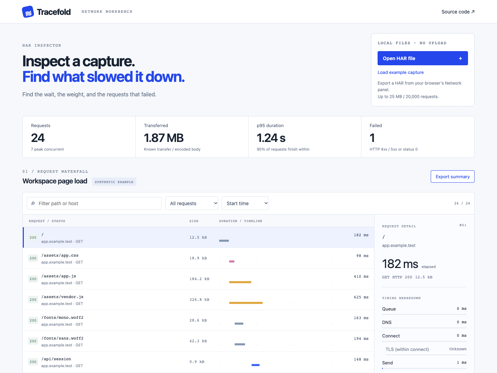

# Tracefold

A browser-based HAR inspector for finding slow, heavy, and failed requests. Open a capture, filter the waterfall, and inspect a request without uploading the file.

[Open the workbench](https://miiduoa.github.io/tracefold/) · [Design notes](docs/design.md) · [繁體中文](docs/README.zh-TW.md)



## Try it

The workbench opens with a **synthetic 24-request capture**. Select **Failed requests** to find the 503 response, or sort by **Slowest first** to inspect `/api/activity`. Open your own `.har` file with the import control. The current capture remains intact if an import fails.

Files stay in memory in the current tab. There is no backend, analytics script, external font, or browser storage. Closing the tab clears the capture. Hosting providers still receive normal requests for the application itself.

## Run locally

Node.js 22.18+ (or 24+):

```sh
npm ci
npm run dev
```

```sh
npm test        # 18 core tests
npm run build  # TypeScript check + production bundle
```

## What it measures

| Measure | Definition |
|---|---|
| Duration | HAR entry `time`; a phase mismatch produces a warning |
| p95 | Nearest-rank percentile of request durations |
| Transfer | `_transferSize` when provided, otherwise encoded `bodySize`; unknown sizes stay unknown |
| Peak concurrent | Sweep of request start/end events; touching endpoints do not overlap |
| Failures | HTTP 4xx / 5xx and status 0 |
| Timeline | Relative to the earliest request in the capture, across all recorded pages |

TLS is included in connect time in HAR. It is displayed as a subset, never added twice. Capture span is **not** page load time, and server wait is **not** a CPU profile. A slow request can be an intentionally long-lived connection.

The exported JSON is an analysis summary, not a reusable HAR. It omits cookies, headers, request and response bodies, URL credentials, query strings, and fragments. **Hostnames and paths remain** and can contain private information. Review them before sharing.

## Boundaries

- HTTP/HTTPS HAR entries only; up to 25 MB and 20,000 requests.
- Rejects malformed entries with their request number; no silent partial totals.
- MIME-based resource classification, not browser initiator tracing.
- Does not infer page-load causality, Core Web Vitals, or production recommendations from one capture.
- Rendering is not virtualized. The request limit is a guardrail, not a claim that every device handles the maximum smoothly.
- Chromium UI checks cover import, malformed import, export, filtering, sorting, selection and a 390 px viewport. Cross-browser and assistive-technology audits remain open.

## Code map

`src/model.ts` contains parsing and statistics without DOM dependencies. `src/main.ts` owns transient UI state and escaped rendering. `src/demo.ts` provides deterministic synthetic traffic. `tests/model.test.ts` covers measurement and input boundaries.

The [HAR specification](https://webperfwg.org/specs/HAR/Overview.html) is the reference for timing and size semantics. MIT licensed.
